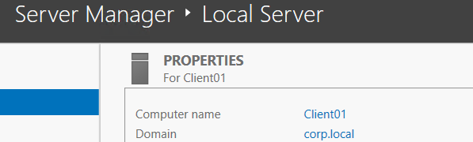
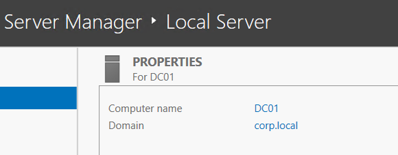
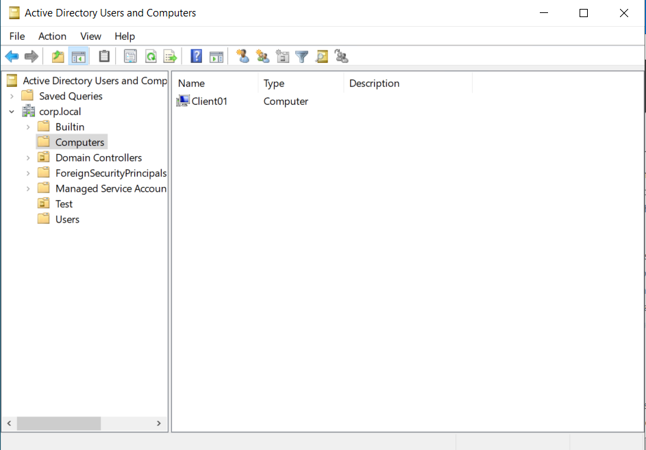
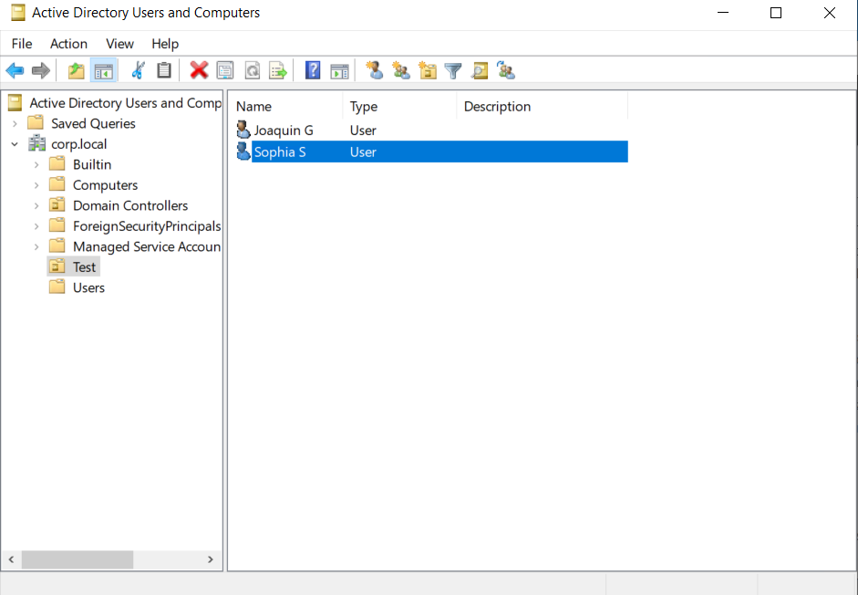
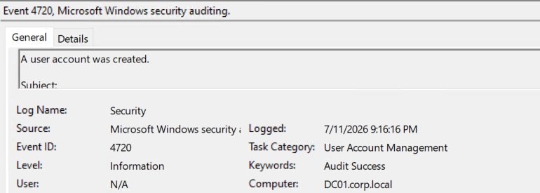
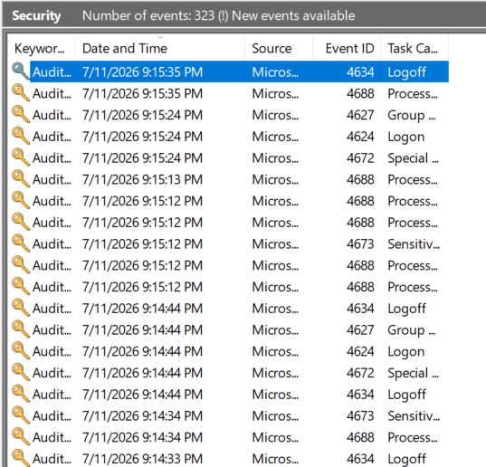
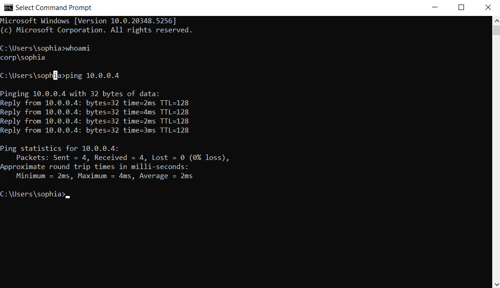

# Cloud‑Based Active Directory Setup & User Management (Azure)

## 🧠 Project Overview
This project demonstrates the deployment of a cloud‑hosted Active Directory environment using Microsoft Azure. A domain controller (DC01) and Windows client (Client01) were configured inside a private virtual network to simulate enterprise identity management, user authentication, and domain join processes.

## ⚙️ Environment Setup
- **Azure Virtual Machines**
  - DC01 – Windows Server 2022
  - Client01 – Windows 10/11
- **Private Virtual Network**
- **DNS configured to point Client01 to DC01**
- **Remote Desktop access for configuration**

## 🔧 Active Directory Configuration
- Installed **Active Directory Domain Services (AD DS)** on DC01  
- Promoted DC01 to a domain controller (`corp.local`)  
- Created Organizational Units (OUs)  
- Added domain users (e.g., Sophia)  
- Joined Client01 to the domain  
- Verified authentication and connectivity  

## 📸 Screenshots

### Client01 Domain Membership

### DC01 Domain Controller

### Active Directory – Computers OU

### Active Directory – Users OU

### Event Viewer – User Account Created (4720)

### Event Viewer – Security Log Overview

### Ping Test & Domain User Verification

## 🔐 Skills Demonstrated
Identity & Access Management (IAM)  
Windows Server Administration  
Azure Virtual Machines  
DNS & Network Configuration  
Kerberos Authentication  
Event Viewer Log Analysis  
Cloud Infrastructure Setup  

## 🧰 Tools Used
Microsoft Azure  
Windows Server 2022  
Active Directory Domain Services  
PowerShell  
Event Viewer  
DNS Manager  

## 🏁 Outcome
Successfully deployed and validated a functional Active Directory domain in Azure. Demonstrated secure user authentication, domain join processes, and core identity management concepts aligned with Security+ and entry‑level SOC analyst skills.

## 🚀 Next Steps (Planned Enhancements)
- Group Policy Objects (GPOs)  
- File server + NTFS permissions  
- SIEM integration (Splunk / Wazuh)  
- Security log monitoring & alerting  
